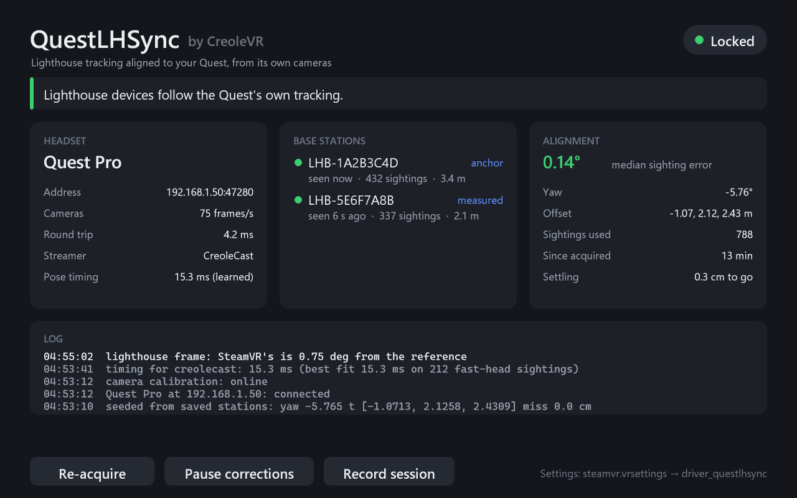

# QuestLHSync

Lighthouse trackers, controllers and base stations aligned to a Quest Pro's or
a Steam Frame's own tracking, continuously, with nothing mounted on the
headset. The headset's tracking cameras see the laser flashes of SteamVR 2.0
base stations. Each flash is a bearing from the headset to a base station. From
those bearings QuestLHSync works out where the lighthouse space sits in the
headset's space and keeps correcting it while you play. Full-body trackers and
Index controllers then line up with a streamed headset without SpaceCalibrator
or a tracker strapped to your head.

It has two parts:

- **A headset part.** It serves what the tracking cameras see of the base
  stations on your local network: a Magisk module on the Quest Pro, a user
  service and a small SteamVR driver on the Steam Frame.
- **A SteamVR driver for the PC.** It solves the alignment and applies it to
  every lighthouse device. It also adds a page to the SteamVR dashboard.



## Requirements

- A **Quest Pro**, rooted with [Magisk](https://github.com/topjohnwu/Magisk).
  Other Quests have tracking cameras too and could work, but it has only been
  tried on a Quest Pro.
- Or a **Steam Frame**. No root, no developer password: everything installs
  as your user.
- **SteamVR 2.0 base stations.** 1.0 stations aren't supported.
- **Windows with SteamVR**, and the headset streamed to it by anything: Steam
  Link, Link, Air Link, Virtual Desktop, ALVR, CreoleCast and so on.
- The PC and the headset on the **same local network**.
- At least **one lighthouse device switched on**, such as a tracker or an Index
  controller. SteamVR only shows base stations while one is on.

## Install

1. Download `QuestLHSync-<version>.zip` from
   [Releases](https://github.com/CreoleVR/QuestLHSync/releases) and extract it.
2. **Headset, Quest Pro:** install `QuestLHSync-magisk-<version>.zip` in the
   Magisk app (**Modules > Install from storage**) and reboot. To install it
   over adb instead:

   ```
   adb push QuestLHSync-magisk-v1.1.zip /sdcard/Download/
   adb shell su -c "magisk --install-module /sdcard/Download/QuestLHSync-magisk-v1.1.zip"
   ```

   **Headset, Steam Frame:** copy `QuestLHSync-frame-<version>.tar.gz` to the
   Frame (over ssh, or a download in Desktop Mode), then in a terminal on it:

   ```
   tar xzf QuestLHSync-frame-v1.1.tar.gz
   QuestLHSync-frame/install.sh
   ```

   It installs into `~/.local/share/questlhsync`, starts `lhsyncd` as a
   systemd user service and restarts SteamVR on the headset once, to load the
   `questlhsync_frame` driver.

3. **PC:** with SteamVR closed, move the `questlhsync` folder somewhere
   permanent and register it (adjust the paths):

   ```
   "C:\Program Files (x86)\Steam\steamapps\common\SteamVR\bin\win64\vrpathreg.exe" adddriver "C:\path\to\questlhsync"
   ```

4. Turn off any other tool that moves lighthouse devices into the headset's
   space, such as SpaceCalibrator or OpenVR-SpaceSync. Two tools correcting
   the same devices fight each other.

## Use

Start SteamVR the way you usually do. QuestLHSync finds the headset on the
network by itself. Its page is in the SteamVR dashboard, and a copy opens on
the desktop. Closing the desktop window hides it until the next SteamVR start.

The first time, look around the room so the cameras catch both base stations
(the Frame's upper cameras see most of them). It locks within about half a
minute, usually sooner. After that it starts from the saved alignment as soon
as the base stations appear. With three base stations, glance at the third one
too: it lets QuestLHSync level its reference frame (see below).

The page shows the headset link, each base station's sightings and the
alignment's median error. Recent log lines are at the bottom. The buttons:

- **Re-acquire** drops the sightings so far and finds the alignment again
  from new ones. Use it if lighthouse devices look out of place. Wear a tracker
  or hold a controller while it acquires (see the mirror check below).
- **Pause corrections** keeps lighthouse devices where they are until you
  resume.
- **Record session** saves everything the driver receives to a file, for bug
  reports. It's off unless you turn it on.

## How it works

- **Headset, Quest Pro.** `lhsyncd` answers discovery on UDP 47281 and serves
  one TCP stream per PC on port 47280. Only while a PC is connected, it runs a
  small Frida script inside the sensors HAL
  (`vendor.oculus.hardware.sensors@1.0-service`). The script reads the two side
  tracking cameras' frame buffers, never writes to them, and reports saturated
  spots in the short-exposure frames. The front cameras are skipped: they never
  saw a base station in testing, only other lights. It stops a few seconds
  after the last PC leaves. Nothing on disk is patched and no partition is
  touched. The camera calibration is read from `/persist/calibration` and sent
  to the PC with the stream.
- **Headset, Steam Frame.** The same `lhsyncd` and protocol, as a systemd user
  service. The four tracking cameras belong to XRService, the Frame's tracking,
  which runs as a child of the headset's own SteamVR. They alternate long and
  short exposures (the short ones light only the controllers' LEDs), and the
  base station lasers show up in the short ones. While a PC is connected,
  `lhsyncd` finds XRService's camera buffers with `VIDIOC_QUERYBUF`, which
  anyone may call. The kernel only lets an ancestor of XRService take its file
  descriptors, so the `questlhsync_frame` driver inside the headset's SteamVR
  lends them over a socket in `$XDG_RUNTIME_DIR` to the same user, and only
  dmabufs. `lhsyncd` maps them read-only and reports the saturated spots of
  every short frame with the frame's own timestamp. The calibration is the
  factory one in `/persist/xrservice.json` and `/persist/device_config.json`.
- **Alignment.** Each spot becomes a ray from the camera, placed at the
  headset's SteamVR pose at the moment of exposure, and is matched to the
  nearest base station. Both spaces share gravity, so the fit has 4 degrees of
  freedom: yaw and a translation. It uses a robust least-squares fit over the
  last few minutes of sightings, with outliers rejected.
- **Mirror check.** Two base stations facing each other at about the same
  height look the same to the cameras with their places swapped. That
  alignment, turned 180° about their midpoint, fits the sightings almost as
  well, but it puts every other lighthouse device across the room. So every
  acquisition also fits that mirror. When both score about the same, the
  trackers and controllers you wear or hold decide: they stay near your head.
  Without one the current alignment stays, and the log says so.
- **Applying it.** The driver hooks
  `IVRServerDriverHost::TrackedDevicePoseUpdated` with MinHook. Every device
  whose tracking system is `lighthouse` gets the transform. The HMD is left
  alone. Corrections are eased in while your head moves, so lighthouse devices
  don't visibly slide.
- **Timing.** Streamers report head poses with different delays. QuestLHSync
  learns the offset between the camera frames and the head pose for each
  streamer, from how the error grows with head speed, and remembers it.
- **Reference frame.** SteamVR re-levels its lighthouse space at every start.
  QuestLHSync pins its own reference frame to one base station, the anchor, so
  a saved alignment stays valid across restarts. That frame keeps whatever tilt
  SteamVR's space had when the anchor was first seen. The alignment fit assumes
  both spaces share gravity and can't see a tilt with only two base stations
  in view, yet 1.5° of it puts trackers on the floor 15 cm to the side. Once
  the cameras have seen three base stations well enough to tell, QuestLHSync
  measures the tilt against the headset's gravity, levels the reference frame
  and keeps the level in `stations.json`.

## Settings

Optional, in `steamvr.vrsettings` under `"driver_questlhsync"`:

| Key | Default | |
|---|---|---|
| `enable` | `true` | `false` turns QuestLHSync off |
| `host` | `""` | The headset's IP address(es), comma-separated, for networks that drop broadcasts |
| `headset` | `""` | A headset serial to prefer when several answer |
| `anyHmd` | `false` | Use SteamVR's headset even when it isn't named a Quest Pro or Steam Frame |
| `record` | `false` | Record every session (same as the button) |

## Files and network

The PC side writes only to `%LOCALAPPDATA%\QuestLHSync`:

| File | |
|---|---|
| `questlhsync.log` | The log, including base station serials |
| `stations.json` | The reference frame: the anchor, its level and the base stations' positions |
| `state.json` | The last alignment and the learned timing per streamer |
| `headset.txt` | The last headset's address and serial, to reconnect when broadcasts are dropped |
| `recordings\` | Only when recording; the newest 10 are kept |

Nothing is sent anywhere except between the PC and the headset. The PC only
makes outgoing connections, so Windows Firewall needs no rule.

While a PC is connected, the camera reader takes about 9% of one of the
headset's CPU cores, and the stream is about 2.5 KB/s. On the PC, the solver uses
about 0.2% of one core.

On the headset, `lhsyncd` answers anyone on the local network. The stream has
no authentication. It carries the spots' pixel positions (never images), the
camera calibration, and the headset's serial number, model and firmware
version. Use it on a network you trust. On the Quest, Frida's temporary files
go to a RAM folder, `/dev/.questlhsync`. On the Frame, `lhsyncd` logs to the
user journal (`journalctl --user -u questlhsync`).

## Troubleshooting

- **"Looking for the headset":** the headset must be awake and on the same
  network. Some routers isolate Wi-Fi clients or drop broadcasts: set `host` to
  the headset's IP address.
- **"No camera frames":** the cameras only run while the headset is tracking.
  Put it on. On the Frame, a "questlhsync_frame SteamVR driver isn't running"
  line in the log means SteamVR on the headset hasn't restarted since the
  install: `systemctl --user restart steamvr.service`.
- **"Waiting for base stations":** switch on a tracker or controller.
- **"Finding the base stations" for a long time:** both base stations need to
  be seen. Face each of them for a few seconds.

## Uninstall

- **Quest Pro:** remove the module in the Magisk app and reboot.
- **Steam Frame:** run `QuestLHSync-frame/uninstall.sh` on the headset.
- **PC:** with SteamVR closed, run
  `vrpathreg removedriver "C:\path\to\questlhsync"`, then delete
  `%LOCALAPPDATA%\QuestLHSync`.

## Compatibility

On the Quest, QuestLHSync finds the camera buffers in the sensors HAL by their
sizes and the order they were allocated in. It was developed on one Quest Pro
and one OS build. Another OS build may lay them out differently. If it does,
the page stays on "No camera frames" and nothing else on the headset is
affected. Frida is pinned to 17.10.0, because 17.19.0 crashed the sensors HAL
on injection.

On the Frame, it reads which node each camera streams from out of XRService's
own log, and the buffers' layout from V4L2. It was developed on one Steam Frame
on SteamOS 20260930. A SteamOS update that changes XRService's log or camera
setup shows up the same way: "No camera frames", with the reason in the log.

## Building

Visual Studio 2022 with C++, the Android NDK (r28c tested) and Python 3:

```
build.bat                        SteamVR driver + dashboard app, into driver\questlhsync (SteamVR closed)
python magisk\build_module.py    Magisk module, into out\ (downloads frida-inject once)
python release.py                out\QuestLHSync-<version>.zip (needs the Frame package in out\ too)
python install.py                register driver\questlhsync with SteamVR, in place
python install.py headset        install the module over adb and start it without a reboot
```

The Steam Frame package builds on the Frame itself or on any arm64 Linux with
Python 3, `cc` and `c++`:

```
python3 frame/build.py           out/QuestLHSync-frame-<version>.tar.gz
```

`lhsyncd`'s core (`src/headset/lhsyncd.c`) is shared by both headsets. Each
one adds its own side behind `src/headset/headset.h`: `magisk/src/quest.c` and
`frame/src/frame.c`.

`build_replay.bat` builds two test tools. `qlhs_replay` runs a recording
through the solver offline. `qlhs_nettest` runs the network link and the solver
against `src\tools\fake_lhsyncd.py`, which replays a recording as a fake
headset.

## License

MIT, see [LICENSE](LICENSE). Third-party code is listed in
[THIRD_PARTY_NOTICES.md](THIRD_PARTY_NOTICES.md).

QuestLHSync is not affiliated with Meta or Valve. Meta Quest is a trademark of
Meta Platforms, Inc.; SteamVR is a trademark of Valve Corporation. Rooting a
headset and running code inside its system services is at your own risk.
